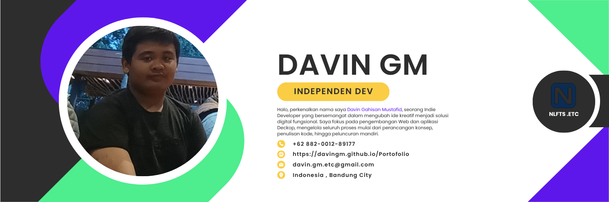

<h1> Hey! Senang Berkenalan Denganmu.</h1>

- 🔭 𝚂𝚊𝚊𝚝 𝚒𝚗𝚒 𝚜𝚎𝚍𝚊𝚗𝚐 𝚖𝚎𝚗𝚐𝚎𝚛𝚓𝚊𝚔𝚊𝚗 **Project Laravel 12.**
- 🌱 𝚂𝚎𝚍𝚊𝚗𝚐 𝚖𝚎𝚗𝚍𝚊𝚕𝚊𝚖𝚒 **DevOps dan Pemrograman Java yang kompetitif.**
- 👯 𝙼𝚎𝚗𝚌𝚊𝚛𝚒 𝚔𝚘𝚕𝚊𝚋𝚘𝚛𝚊𝚜𝚒 𝚍𝚒 **Deckop app, Ai Enginer, atau Pengembangan Web.**
- 💬 𝚃𝚊𝚗𝚢𝚊𝚔𝚊𝚗 𝚊𝚙𝚊 𝚜𝚊𝚓𝚊 𝚔𝚎𝚙𝚊𝚍𝚊 𝚜𝚊𝚢𝚊 [di sini](https://github.com/DavinGM) ! 𝚂𝚊𝚢𝚊 𝚜𝚎𝚗𝚊𝚗𝚐 𝚖𝚎𝚗𝚋𝚊𝚗𝚝𝚞 anda.
- 😄 𝙿𝚛𝚘𝚗𝚘𝚞𝚗𝚜 : **Dia/Laki-laki.**
- ⚡ 𝙵𝚊𝚔𝚝𝚊 𝚄𝚗𝚒𝚔 : **Bagian terbaik nya atur atur aja dulu*.**

 
 

Selamat Datang, Pengembara 👋.

Saya Davin Gahisan Mustafid (Davin GM), seorang pengembang independen (independent developer) yang berasal dari Bandung, Indonesia. Perjalanan saya di dunia pengembangan perangkat lunak (software development) dimulai dari ketertarikan pada koding di tahun 2023. Awalnya, saya mendalami peran sebagai Backend Developer saat memasuki jenjang Sekolah Menengah Kejuruan (SMK), dengan bahasa pemrograman pertama saya adalah PHP.

Namun, minat saya bergeser. Saat ini, saya lebih fokus dan memiliki ketertarikan kuat pada bidang Frontend Developer. Pada tahun 2024, saya mulai mempelajari dasar-dasar JavaScript dan CSS sebagai langkah awal saya dalam pengembangan frontend hingga saat ini. dan jika kamu tertarik untuk Membantu saya dan berkontirbusi saya akan sanggat sanggat berterimakasih

<h3>Teknologi dan Alat yang Saya Gunakan</h3>

<h3>Open source projects</h3>

<h3>My latest posts</h3>
<ul>
    <li><a href="https://santrikoding.com/"><b> Tempat Belajar Coding andalan Santri</b></a> <i>Cara efektif memahami dasar Membangun aplikasi dari 0.</i></li>
    <li><a href="https://youtu.be/kcnwI_5nKyA?si=f6LejStZBRxl74fH"><b> React Dasar Paling Masuk Akal</b></a> <i>Panduan singkat dan logis untuk mulai belajar React dari nol.</i></li>
    <li><a href="https://youtu.be/4B9XYXCBYkA?si=V0-UbRKjqQKd7GmG"><b> Belajar Cofigurasi Tailwinds terbaru </b></a> <i>Simak tips mengatasi konfigurasi Tailwind yang rumit agar tetap produktif.</i></li>

## Sratistik saya Di github

<!--START_SECTION:waka-->

**🐱 My GitHub Data** 

// EMPTY

# Pahami Saya Lebih Jauh

# Nice once

  
  

  

