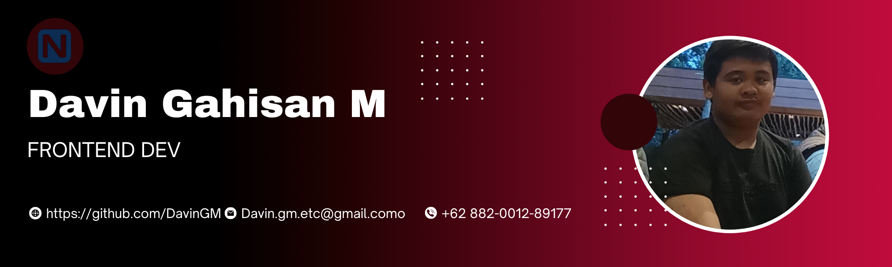

<h1> Hey! Senang Berkenalan Denganmu.</h1>


- 🔭 𝚂𝚊𝚊𝚝 𝚒𝚗𝚒 𝚜𝚎𝚍𝚊𝚗𝚐 𝚖𝚎𝚗𝚐𝚎𝚛𝚓𝚊𝚔𝚊𝚗 **Project Laravel 12.**
- 🌱 𝚂𝚎𝚍𝚊𝚗𝚐 𝚖𝚎𝚗𝚍𝚊𝚕𝚊𝚖𝚒 **DevOps dan Pemrograman Java yang kompetitif.**
- 👯 𝙼𝚎𝚗𝚌𝚊𝚛𝚒 𝚔𝚘𝚕𝚊𝚋𝚘𝚛𝚊𝚜𝚒 𝚍𝚒 **Deckop app, Ai Enginer, atau Pengembangan Web tingkat Pro.**
- 💬 𝚃𝚊𝚗𝚢𝚊𝚔𝚊𝚗 𝚊𝚙𝚊 𝚜𝚊𝚓𝚊 𝚔𝚎𝚙𝚊𝚍𝚊 𝚜𝚊𝚢𝚊 [di sini](https://github.com/DavinGM) ! 𝚂𝚊𝚢𝚊 𝚜𝚎𝚗𝚊𝚗𝚐 𝚖𝚎𝚗𝚋𝚊𝚗𝚝𝚞 anda.
- 😄 𝙿𝚛𝚘𝚗𝚘𝚞𝚗𝚜 : **Dia/Laki-laki.**
- ⚡ 𝙵𝚊𝚔𝚝𝚊 𝚄𝚗𝚒𝚔 : **Bagian terbaik nya atur atur aja dulu*.**

<br/>
<br/>


<p>Selamat Datang Pengembara </br> Aku Davin Gahisan M Seorang Developer indie saya berasal dari   <b>indonesia, Bandung</b>
<h3>Hal-Hal yang saya Pakai dalam Coding</h3>
<p>


<h3>Open source projects</h3>
<table>
  <thead align="center">
    <tr border: none;>
      <td><b>🎁 Projects</b></td>
      <td><b>⭐ Stars</b></td>
      <td><b>📚 Forks</b></td>
      <td><b>🛎 Issues</b></td>
      <td><b>📬 Pull requests</b></td>
    </tr>
  </thead>
  <tbody>
    <tr>
      <td><a href="https://github.com/thmsgbrt/react-simple-pull-to-refresh"><b>Laravel Sistem Curd dan ORM</b></a></td>
      <td></td>
      <td></td>
      <td></td>
      <td></td>
    </tr>
	  <tr>
      </tr>
  </tbody>
</table>
<h3>My latest posts</h3>
<ul>
    <li><a href="#"><b> Tips Belajar Laravel Cepat</b></a><br/><i>Cara efektif memahami dasar Laravel dan membangun aplikasi dengan cepat.</i></li>
    <li><a href="#"><b> React Dasar Paling Masuk Akal</b></a><br/><i>Panduan singkat dan logis untuk mulai belajar React dari nol.</i></li>
    <li><a href="#"><b> Tailwind Makin Canggih? Tapi Konfigurasinya Bikin Developer Muntah</b></a><br/><i>Simak tips mengatasi konfigurasi Tailwind yang rumit agar tetap produktif.</i></li>

## Sratistik saya Di github


<!--START_SECTION:waka-->


**🐱 My GitHub Data** 

> 📦 100.2+ MB Terpakai di github
 > 
> 🏆 1 Kontribusi di tahun 2025
 > 
> 💼 Siap Menerima Lowongan Kerja
 > 
> 📜 3 Public Repositories 
 > 
> 🔑 1 Private Repositories 
 > 
**Aktivitas saya**

```text
🌞 Pagi      15 commits   ███░░░░░░░░░░░░░░░░░░░░░░   5.00%
🌆 Siang     35 commits   ██████░░░░░░░░░░░░░░░░░░░   11.67%
🌃 Sore     100 commits   █████████████░░░░░░░░░░░░   33.33%
🌙 Malam    150 commits   ████████████████████░░░░░   50.00%
```

**Project yang sedang berjalan**

```text
React      12 commits   ████░░░░░░░░░░░░░░░░░░░░░   12%
Laravel    45 commits   ██████████████████████░░░   45%
```

# Pahami Saya Lebih Jauh


